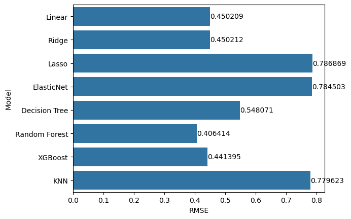
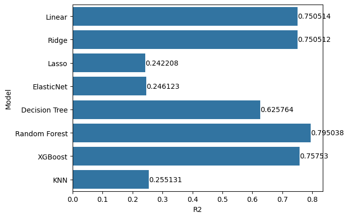
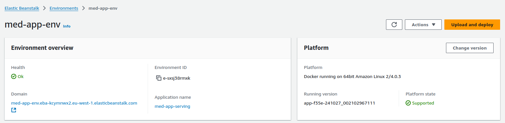

# Medical Cost Prediction

<p align="center">
  
</p>

[](https://www.python.org/downloads)
[](https://www.docker.com)
[](https://aws.amazon.com/elasticbeanstalk)
[](https://opensource.org/licenses/MIT)

## Table of Contents
- [Overview](#overview)
- [Data Source](#data-source)
- [Exploratory Data Analysis](#exploratory-data-analysis)
- [Model Selection](#model-selection)
- [Technical Architecture](#technical-architecture)
- [Deployment](#deployment)
- [Contributing](#contributing)
- [Acknowledgements](#acknowledgements)
- [License](#license)
- [Contact](#contact)

## Overview

**Problem Statement:**  
Medical insurance costs can vary widely based on factors like age, lifestyle, and pre-existing conditions. Accurately predicting these costs helps both insurance companies and individuals to make informed financial decisions. This project aims to build a predictive model that estimates yearly medical insurance costs based on personal attributes, such as age, sex, BMI, number of children, smoking status, and geographic location, using a regression algorithm.

**Usecases:**  
For insurance providers, an accurate prediction model helps in setting premiums that reflect an individual’s health risk, leading to fairer pricing and better risk management. For policyholders, understanding factors that drive their insurance costs can guide them in making healthier lifestyle choices to reduce future premiums. This project’s model could serve as a foundational tool for personalized pricing strategies, helping in financial planning and fostering more transparent relationships between insurers and clients.

## Data Source
The dataset used in this project is the [Medical Cost Personal Dataset](https://www.kaggle.com/datasets/mirichoi0218/insurance), publicly available on [Kaggle](https://www.kaggle.com) and in the ```Data``` folder of this project. This dataset includes records of **1,338** individuals and captures key personal and demographic information, such as age, gender, body mass index (BMI), number of dependents, smoking status, and region of residence in the U.S. The primary target variable ```charges```  is the medical insurance cost incurred by each individual in a year. Below is a snippet of the dataset:

---

**Dataset Sample**

| Age | Sex   | BMI   | Children | Smoker | Region    | Charges      |
|-----|-------|-------|----------|--------|-----------|--------------|
| 19  | Female | 27.9  | 0        | Yes    | Southwest | 16,882.67    |
| 18  | Male   | 33.8  | 1        | No     | Southeast | 1,721.35     |
| 28  | Male   | 33.0  | 3        | No     | Southeast | 4,444.43     |
| 33  | Male   | 22.7  | 0        | No     | Northwest | 3,219.86     |
| 32  | Female | 28.9  | 0        | Yes    | Southeast | 39,323.77    |

---

## Exploratory Data Analysis
The next step in the machine learning pipeline is data understanding through Exploratory Data Analysis (EDA). This includes checking for missing values and handling them, understanding data distribution and correlation to make informed transformations of the data, and selecting a subset of the available features if necessary. The EDA for this project is available in the jupyter notebook ```notebook.ipynb```. Summary from EDA:

- The dataset is clean and has no missing values.
- The target variable (```charges```) has a long tail and needs to be transformed.
- Feature selection is not beneficial for this task.
- The ```age``` variable is the top predictive variable.

## Model Selection
For this project, eight regression algorithms were compared before selecting a final one. They are:

  - Linear Regression
  - Ridge Regression
  - Lasso Regression
  - Elastic Net
  - Decision Tree Regression
  - Random Forest Regression
  - XGBoost
  - K-Nearest Neighbors Regression
    
<div align="center">
	
	
</div>

Based on the Mean Squared Error and R2 scores, Random Forest Regression was the best-performing algorithm and was selected to build the final model. The code for the model selection is available in ```notebook.ipynb```.

## Technical Architecture
- **App Framework**: Flask
- **ML Framework**: Scikit-learn
- **Model**: Random Forest Classifier (max_depth=5, n_estimators=400)
- **Deployment**: AWS Elastic Beanstalk with Docker
- **API Protocol**: REST
- **Input/Output**: JSON

## Deployment

### Local 

1. Clone the repository:
```bash
git clone https://github.com/F-U-Njoku/medical-cost-prediction.git
cd medical-cost-prediction
```

2. Install dependencies using Pipenv:
```bash
pip install pipenv
pipenv install
```

3. Run the application:
```bash
pipenv run gunicorn --bind 0.0.0.0:8080 predict:app
```

3. Use the application:
```bash
pipenv run python test.py
```

### Docker 

1. Build the Docker image:
```bash
docker build -t med-cost-predictor .
```

2. Run the container:
```bash
docker run -p 8080:8080 med-cost-predictor
```

3. Use the application:
```bash
pipenv run python test.py
```

### Cloud 

So far, the application has been used locally, however, it has been deployed to the cloud with AWS Elastic Beanstalk.

<p align="center">
  
</p>

1. Change the URL from local to cloud  in the ```test.py``` file:
```bash
url = f'http://{local}/predict'
url = f'http://{cloud}/predict'
```
2. Use the application:
```bash
pipenv run python test.py
```
### Example 
 Request:
```
applicant = {
    "age": 35,
    "sex": "male",
    "bmi": 26.5,
    "children": 2,
    "smoker": "no",
    "region": "northeast"
}
```

Output:
```
The predicted medical cost is 12345.67 yearly.
```
Change details of the applicant in the ```test.py``` file and run it to get new predictions.

## Model Information

- **Algorithm**: Random Forest Regressor
- **Features**: age, sex, bmi, children, smoker status, region
- **Target Variable**: charges (log-transformed)
- **Model Performance**: 0.3535 (Root Mean Squared Error)

## Dependencies

- Python 3.11
- Flask
- scikit-learn
- numpy
- pandas
- gunicorn (for production deployment)

## Contributing

We welcome contributions to the Travel Itinerary Planner! Here's how you can help:

1. Fork the repository
2. Create a new branch (`git checkout -b feature/AmazingFeature`)
3. Make your changes
4. Commit your changes (`git commit -m 'Add some AmazingFeature'`)
5. Push to the branch (`git push origin feature/AmazingFeature`)
6. Open a Pull Request

Please ensure your code adheres to the project's coding standards and includes appropriate tests.

## Acknowledgements

Special thanks to the Datatalks club for providing a practical and free course on Machine Learning. Gratitude to Alexey and the entire team for their efforts.

## License

This project is licensed under the MIT License - see the [LICENSE](https://opensource.org/license/mit) file for details.


## Contact
- LinkedIn: [Uchechukwu Njoku](https://www.linkedin.com/in/funjoku/)
